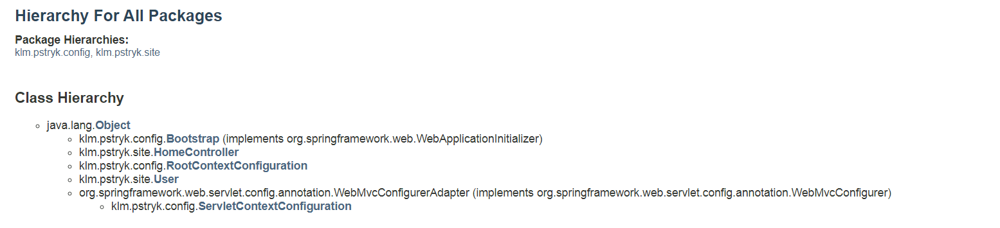

# klmspringmvc
KLM A Model-View-Controller desing pattern with Spring framework

MVC in a few words....
Being concise *controllers* manipulate data in a *model* that represents information the user is interested in and pass that model on to the view, which renders the model in a way useful to the user. The point is to separate different application layers ie Model as business logic, Controller as a director of the flow process and View as presentation layer.

Package and class hierarchy looks like this:


To dispatch the client to a different URL I use **org.springframework.web.servlet.view.RedirectView**. 

The **HomeController** has several request handler methods. First is **home(Map)**, where argument **Map<String, Object> model** stands for Model.
```java
@Controller
public class HomeController
{
    @RequestMapping("/")
    public View home(Map<String, Object> model)
    {
        model.put("dashboardUrl", "dashboard");
        return new RedirectView("/{dashboardUrl}", true);
    }
...
}
```
Obviously I could construct the view using the static URL string( new RedirectView("/dashboard", true)), but I would prefer to utilize *the replacement template* and pull dynamically attributes from the model. Now when we are transfered to /dashboard we serve it with another request handler method.
```java
    @RequestMapping(value = "/dashboard", method = RequestMethod.GET)
    public String dashboard(Map<String, Object> model)
    {
        model.put("text", "This is a model attribute.");
        model.put("date", Instant.now());
        return "home/dashboard";
    }
```
The **dashboard(Map)** responds to the **/dashboard** URL, saves into the model text and date attributes and returns the String name  **home/dashboard** of a view. Then Spring resolves it to *WEB-INF/jsp/view/home/dashboard.jsp* using **JstlView** resolver that I configured in **ServletContextConfiguration** :
```java
    @Bean
    public ViewResolver viewResolver()
    {
        InternalResourceViewResolver resolver =
                new InternalResourceViewResolver();
        resolver.setViewClass(JstlView.class);
        resolver.setPrefix("/WEB-INF/jsp/view/");
        resolver.setSuffix(".jsp");
        return resolver;
    }
```
So we have two JSP views. ---- View Layer
*WEB-INF/jsp/view/home/dashboard.jsp*
```jsp
<%--@elvariable id="text" type="java.lang.String"--%>
<%--@elvariable id="date" type="java.time.Instant"--%>
<!DOCTYPE html>
<html>
    <head>
        <title>Dashboard</title>
    </head>
    <body>
        Text: ${text}<br />
        Date: ${date}
    </body>
</html>
```
It just puts on view two model attributes that are exposed as EL variables for the JSP thanks to *Spring JstlView ViewResolver*.


#viewing implicitly model attributes
To view implicitly model attributes I use  **org.springframework.web.servlet.RequestToViewNameTranslator** configured in **ServletContextConfiguration** this way:
```java
    @Bean
    public RequestToViewNameTranslator viewNameTranslator()
    {
        return new DefaultRequestToViewNameTranslator();
    }
```
I utilize deafult option **org.springframework.web.servlet.view.DefaultRequestToViewNameTranslator**

The **userHome()** method of the **HomeController**, mapped to the **/user/home** URL constructs and populates a new **User** object, returns it, and also adds it to the model with the attribute key **currentUser** thanks to @ModelAttribute annotation.
```java
    @RequestMapping(value = "/user/home", method = RequestMethod.GET)
    @ModelAttribute("currentUser")
    public User userHome()
    {
        User user = new User();
        user.setUserId(1234987234L);
        user.setUsername("stefan");
        user.setName("Stefan Nowak");
        return user;
    }
```
Thanks to setting up the view name translation the view name becomes **user/home**, so I have to have this view in *WEB-INF/jsp/view/user/home.jsp*, where I can utilize again EL variables with **"currentUser"** object.
```jsp
<%--@elvariable id="currentUser" type="klm.pstryk.site.User"--%>
<!DOCTYPE html>
<html>
    <head>
        <title>User Home</title>
    </head>
    <body>
        ID: ${currentUser.userId}<br />
        Username: ${currentUser.username}<br />
        Name: ${currentUser.name}<br />
    </body>
</html>
```

In the app there is another functionality. I employ content negotiation in Spring that allows to change the content type received back to the client based on a file extension. The configuration resides of course in **ServletContextConfiguration**.
```java
    @Override
    public void configureContentNegotiation(
            ContentNegotiationConfigurer configurer)
    {
        configurer.favorPathExtension(true).favorParameter(false)
                .parameterName("mediaType").ignoreAcceptHeader(false)
                .useJaf(false).defaultContentType(MediaType.APPLICATION_XML)
                .mediaType("xml", MediaType.APPLICATION_XML)
                .mediaType("json", MediaType.APPLICATION_JSON);
    }
```
And I use it in the **HomeController** with **@ResponseBody** annotation.

```java
    @RequestMapping(value = "/user/{userId}", method = RequestMethod.GET)
    @ResponseBody
    public User getUser(@PathVariable("userId") long userId)
    {
        User user = new User();
        user.setUserId(userId);
        user.setUsername("piotr");
        user.setName("Piotr Wysmial");
        return user;
    }
```
Thanks to this the mapped views eg **user/1** and **user/1.json** properly render with "xml view" and "json view" as relevant.


